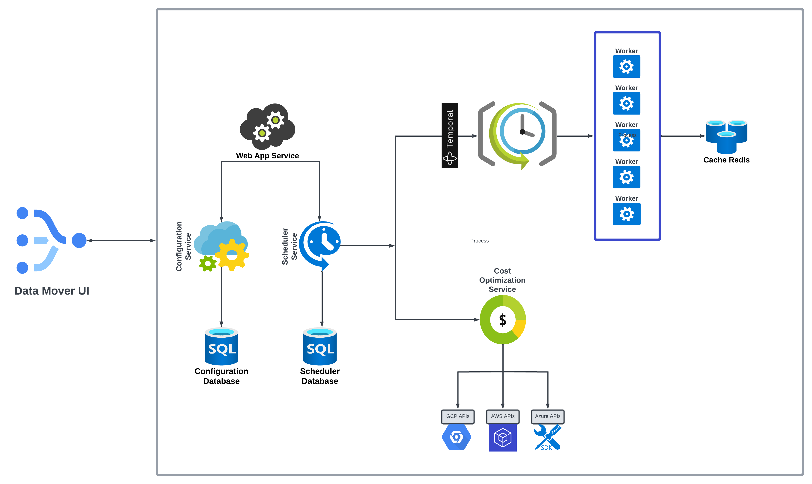

# Data Mover

Cost-effective Extract-Load-Transform (ELT) Tool.


## Docs
1. [Design Document](https://docs.google.com/document/d/14tBpxzIG12VEKYUUH8YGCofWR9Pn1dcKumXq6VUu_0Y/edit?usp=sharing)
2. [Architecture Diagram](https://lucid.app/lucidchart/92dc16db-3cd5-4b8d-b574-caa8cb4f3a45/edit?invitationId=inv_9d8bc503-0297-4eee-a6b0-3cd88cc86a86)
3. [Agile Board](https://mint-gym-384.notion.site/c99a09c0e28340fe98c2695a56bbf2e0?v=0cdf63f9536c42e2801e12b8afcf57f2)
4. [Presentation Slides](https://docs.google.com/presentation/d/1HgMqxOrDerfOIp-fomr8atDA8i36jjN7rI9GRunz4e8/edit?usp=sharing)

## Repo Maintainance
```
Commit Message Header
<type>: <short summary>
  │       │
  │       └─⫸ Summary in present tense. Not capitalized. No period at the end.
  │       
  │       
  │                          
  │                          
  │                          
  │                         
  │
  └─⫸ Commit Type: docs|feat|fix|refactor
The <type> and <summary> fields are mandatory
```
Type must be one of the following:
```
docs: Documentation only changes
feat: A new feature
fix: A bug fix
refactor: A code change that neither fixes a bug nor adds a feature
```
